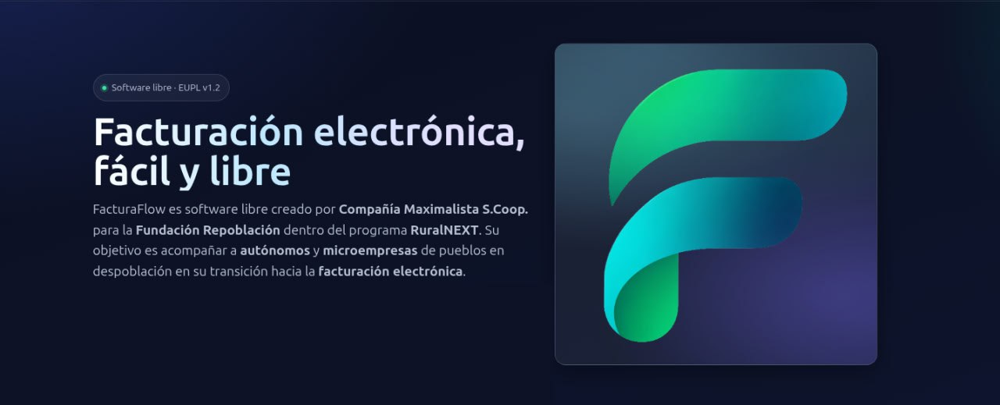

# FacturaFlow

FacturaFlow es una plataforma web para emitir, firmar y enviar Facturae con total trazabilidad. Está pensada para despachos, pymes y cooperativas que trabajan con FACe, FACeB2B y Veri*Factu, y que necesitan centralizar certificados, firmas y entregas sin complicaciones.

## Qué puedes hacer con FacturaFlow
- Registrar emisores, clientes y productos desde una única interfaz.
- Generar facturas en formato Facturae con QR Veri*Factu listo para enviar.
- Firmar con AutoFirma en el puesto del usuario y con el certificado de plataforma en el servidor.
- Enviar automáticamente a FACe, FACeB2B y AEAT, con seguimiento de cada entrega.
- Recibir facturas de FACeB2B, revisar su estado y gestionarlas desde el mismo panel.
- Trabajar con varias entidades o clientes creando instancias independientes que comparten la misma plataforma.

## Requisitos previos
Antes de empezar, asegúrate de tener:
- Acceso a FACeB2B como "cliente" y como ESF (Empresa de Servicios de Facturación).
- Acceso a FACe como proveedor si vas a enviar facturas a Administraciones Públicas.
- PHP 8.1 o superior con extensiones `openssl`, `curl`, `soap`, `json`, `dom`, `libxml`, `mbstring`, `zip`.
- Composer, Git y un servidor web (Apache/Nginx) que ejecute PHP.
- Un certificado P12/PFX del emisor (cada usuario) y un certificado P12 de plataforma (ESF) para firmar los envíos.

## Instalación paso a paso
Sigue estas etapas por orden. El resultado será una carpeta segura de plataforma y tantas instancias web como necesites.

### 1. Prepara la carpeta de plataforma (`cifra`)
Esta carpeta guarda certificados y claves. Debe quedar fuera del `DocumentRoot` del servidor.

```bash
sudo mkdir -p /var/www/cifra
sudo chown -R root:www-data /var/www/cifra
sudo find /var/www/cifra -type d -exec chmod 750 {} \;
sudo find /var/www/cifra -type f -exec chmod 640 {} \;
```

### 2. Coloca el certificado de plataforma
- Copia tu P12 de plataforma a `/var/www/cifra/max.p12` (puedes usar otro nombre si lo reflejas en la configuración).
- Si la contraseña está sin cifrar, guárdala en un archivo de texto sencillo (`max.pass`, `faceb2b.pass` o `p12.pass`) dentro de `/var/www/cifra/`.
- Si prefieres cifrarla (recomendado), continúa con el paso siguiente y añade la clave cifrada en `faceb2b.json`.

### 3. (Opcional pero recomendado) Genera una clave de cifrado
Esta clave permite guardar la contraseña del P12 cifrada.

```bash
sudo bash -c 'openssl rand -base64 48 > /var/www/cifra/secret.key'
sudo chown root:www-data /var/www/cifra/secret.key
sudo chmod 640 /var/www/cifra/secret.key
```

### 4. Configura FACeB2B
Crea `/var/www/cifra/faceb2b.json` para definir la ruta al certificado y su contraseña.

```json
{
  "p12_path": "/var/www/cifra/max.p12",
  "p12_pass": "enc:v1:...clave_cifrada...",
  "rest_base": "https://api.face.gob.es/faceb2b",
  "timeout": 30
}
```

Si usas un `.pass` en texto plano, puedes omitir `p12_pass` en el JSON.

### 5. Crea una instancia de usuario
Cada entidad usuaria necesita su propia copia del proyecto dentro del `DocumentRoot`.

```bash
# Ejemplo para la entidad "acme"
sudo mkdir -p /var/www/html/users/acme
cd /var/www/html/users/acme
sudo git clone https://github.com/ciamaximalista/facturaflow .
sudo chown -R www-data:www-data /var/www/html/users/acme
```

### 6. Instala dependencias PHP
Ejecuta Composer como el usuario que corre el servidor web.

```bash
cd /var/www/html/users/acme
sudo -u www-data composer install --no-dev --prefer-dist
```

### 7. Enlaza la instancia con la plataforma
Junto al `index.php` de la instancia, crea `config_plataforma.json` apuntando a la carpeta `cifra`.

```json
{
  "cifra_dir": "../../cifra"
}
```

Ajusta el camino si la plataforma está en otra ruta. Para la instalación en `/var/www/html/ruralnext/facturaflow/repoblacion`, usa `"../../../../cifra"`.

### 8. Prepara la carpeta de datos
Cada instancia almacena información del emisor y sus facturas en `data/`.

```bash
cd /var/www/html/users/acme
sudo mkdir -p data
sudo chown -R www-data:www-data data
sudo find data -type d -exec chmod 750 {} \;
sudo find data -type f -exec chmod 640 {} \;
```

### 9. Configura el virtual host
- Apunta el `DocumentRoot` del dominio o subcarpeta a la ruta de la instancia (`/var/www/html/users/acme`).
- Habilita PHP y las extensiones necesarias.
- Recarga el servicio web.

### 10. Registra al emisor
Accede a la URL pública de la instancia. La primera vez, el asistente te pedirá:
- Datos fiscales del emisor.
- Certificado P12 del usuario y su contraseña.
- Preferencias de serie, numeración y logo.

Una vez completado, el usuario podrá generar y firmar facturas desde el navegador.

## Primeros pasos dentro de la aplicación
- **Emitir**: crea clientes y productos, genera una nueva factura y firma con AutoFirma. El sistema firma el XML y el QR Veri*Factu.
- **Enviar**: selecciona la factura y envíala a FACe, FACeB2B o AEAT. El sistema registra el envío con acuses y errores.
- **Recibir**: sincroniza con FACeB2B para traer nuevas facturas y actualiza su estado (aceptada, rechazada, pagada).
- **Historial**: consulta firmas, versiones y logs para auditoría completa.

## AutoFirma sin complicaciones
FacturaFlow detecta AutoFirma en tu navegador y no necesita servicios locales adicionales.
- Instala AutoFirma desde la web oficial y ejecútala al menos una vez.
- Si el protocolo `afirma://` no se abre, instala el Configurador AutoFirma y vuelve a intentarlo.
- Puedes revisar `~/.autofirma/AutoFirma.log` (Linux) o los registros del sistema si algo falla.

## Consejos de seguridad
- Mantén `/var/www/cifra` fuera del `DocumentRoot` y con permisos estrictos.
- Usa contraseñas cifradas (`enc:v1:`) siempre que sea posible.
- Cada instancia debe tener su carpeta `data/` con permisos 750/640 y propiedad `www-data`.

## Actualizaciones
Para actualizar una instancia sin perder datos:

```bash
cd /var/www/html/users/<usuario>
sudo -u www-data git pull
sudo -u www-data composer install --no-dev --prefer-dist
```

Los archivos de configuración (`config_plataforma.json`, carpeta `data/`) no se sobrescriben si mantienes esos nombres.

## Dónde pedir ayuda
- Repositorio: https://github.com/ciamaximalista/facturaflow
- Incidencias, dudas y nuevas funcionalidades: abre un issue o envía un pull request.
